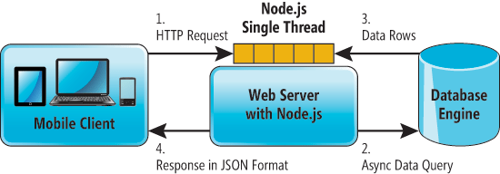

[](https://travis-ci.org/RecodeJr/Gamification)
# Gamification

-----------------------------


## Rodando o webServer

### Pré-Requisitos

- [Node.js 6.10.0 LTS](https://nodejs.org/en/download/package-manager/)
- [MySQL](https://dev.mysql.com/downloads/workbench/)

Na pasta do WebServer você roda os seguintes comandos para rodar:

- ```npm install ```
- ```node index.js ```
- O sistema estará rodando no ```localhost:5000```



